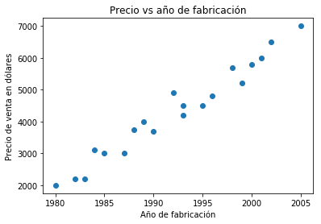

```python
#Importar librerías
```


```python
import matplotlib.pyplot as plt
```


```python
import numpy as np
```


```python
import pandas as pd
```


```python
#Importar el dataset y asignarlo a una variable para poder manejarlo mejor
```


```python
datos_autos = pd.read_csv("/Users/cristianrizzi/Documents/Pansophia/MachineLearning/Datasets/precio_autos.csv")
```


```python
#Mostrar las primeras cinco filas de datos (la "cabeza" del dataset)
```


```python
datos_autos.head()
```


<div>
<style scoped>
    .dataframe tbody tr th:only-of-type {
        vertical-align: middle;
    }

    .dataframe tbody tr th {
        vertical-align: top;
    }

    .dataframe thead th {
        text-align: right;
    }
</style>
<table border="1" class="dataframe">
  <thead>
    <tr style="text-align: right;">
      <th></th>
      <th>Año</th>
      <th>Precio</th>
    </tr>
  </thead>
  <tbody>
    <tr>
      <th>0</th>
      <td>1980</td>
      <td>2000</td>
    </tr>
    <tr>
      <th>1</th>
      <td>1985</td>
      <td>3000</td>
    </tr>
    <tr>
      <th>2</th>
      <td>1983</td>
      <td>2200</td>
    </tr>
    <tr>
      <th>3</th>
      <td>1990</td>
      <td>3700</td>
    </tr>
    <tr>
      <th>4</th>
      <td>1995</td>
      <td>4500</td>
    </tr>
  </tbody>
</table>
</div>


```python
#Importar librería para graficar
```


```python
%matplotlib inline
```


```python
#Colocar títulos a los ejes, al gráfico y graficar
```


```python
plt.ylabel('Precio de venta en dólares'), plt.xlabel('Año de fabricación'), plt.title("Precio vs año de fabricación"), plt.scatter(datos_autos["Año"],datos_autos["Precio"])
```


    (Text(0, 0.5, 'Precio de venta en dólares'),
     Text(0.5, 0, 'Año de fabricación'),
     Text(0.5, 1.0, 'Precio vs año de fabricación'),
     <matplotlib.collections.PathCollection at 0x11bd911d0>)





```python
# Ahora vamos a dividir nuestro dataset en una *matriz* de atributos (las variables independientes) y un *vector* de etiquetas (variable dependiente)
```


```python
atributos = datos_autos.iloc[:,0:1].values
```


```python
etiquetas = datos_autos.iloc[:,1].values
```


```python
#Vamos a imprimir ambos para ver si es lo que queríamos
```


```python
print(atributos)
```

    [[1980]
     [1985]
     [1983]
     [1990]
     [1995]
     [1998]
     [1987]
     [2001]
     [1989]
     [1993]
     [1982]
     [1992]
     [1993]
     [2002]
     [2000]
     [1988]
     [1996]
     [2005]
     [1999]
     [1984]]


```python
print(etiquetas)
```

    [2000 3000 2200 3700 4500 5700 3000 6000 4000 4200 2200 4900 4500 6500
     5800 3750 4800 7000 5200 3100]


```python
#Vamos a usar el 80% de nuestro dataset para entrenar el algoritmo y 20% para probarlo
```


```python
from sklearn.model_selection import train_test_split  
```


```python
entrenar_atributos, probar_atributos, entrenar_etiquetas, probar_etiquetas = train_test_split(atributos, etiquetas, test_size = 0.2, random_state = 0)
```


```python
#En nuestro dataset no hace falta escalar los datos ya que ambos están expresados en miles
```


```python
#Ahora vamos a entrenar el algoritmo y hacer predicciones
```


```python
#PREDICCIONES
```


```python
from sklearn.linear_model import LinearRegression  
```


```python
reg_lin = LinearRegression()
```


```python
reg_lin.fit(entrenar_atributos, entrenar_etiquetas)
```


    LinearRegression(copy_X=True, fit_intercept=True, n_jobs=None,
             normalize=False)


```python
#Veamos cuál es el coeficiente que encontró nuestro modelo para la única variable independiente:
```


```python
print(reg_lin.coef_)
```

    [204.8158111]


```python
#Este coeficiente significa que para cada unidad de cambio de año el precio se incrementa en 204.815
```


```python
#Ahora que el modelo está entrenado debemos predecir una nueva instancia
```


```python
#Para esto vamos a usar el método Predict de la clase LinearRegression
```


```python
predicciones = reg_lin.predict(probar_atributos) 
```


```python
#Con el comando anterior, todas las predicciones se guardaron en la variable 'predicciones'
```


```python
#Ahora vamos a comparar el valor predicho con los valores actuales:
```


```python
comparación = pd.DataFrame({'Real':probar_etiquetas, 'Predicciones':predicciones})
```


```python
print(comparación)
```

       Real  Predicciones
    0  5200   5689.172831
    1  3000   2821.751476
    2  3100   2616.935665
    3  4000   3641.014720


```python
#Según el resultado anterior, hay 4 (cuatro) valores en el set de prueba, lo cual representa el 20% de todo el dataset, tal como lo habíamos especificado en train_test_split. Los valores son cercanos, pero no son exactos. 
```


```python
#Para evaluar la performance de un modelo de Machine Learning, se usan tres valores: el Error Promedio Absoluto (MAE); el Error Promedio Cuadrático (MSE) y el Error Promedio de la Raíz Cuadrada (RMSE)
```


```python
#La clase 'metrics' de la librería 'sklearn' tiene funciones ya incorporadas para calcular estos valores:
```


```python
from sklearn import metrics  
```


```python
print('MAE:', metrics.mean_absolute_error(probar_etiquetas, predicciones))  
```

    MAE: 377.36774265859276


```python
print('MSE:', metrics.mean_squared_error(probar_etiquetas, predicciones))  
```

    MSE: 158321.0446021619


```python
print('RMSE:', np.sqrt(metrics.mean_squared_error(probar_etiquetas, predicciones)))
```

    RMSE: 397.8957710282454


```python
#Normalmente, si el valor de MAE y RMSE es inferior al 10% del valor medio de la columna predicha, el rendimiento del algoritmo se considera bueno.
```


```python
#Sin embargo, cuanto menores sean los valores de MAE y RMSE, más alto será el rendimiento del algoritmo.
```


```python
#En nuestro caso, los valores de MAE y RMSE son 377.36 y 397.85, que es inferior al 10% del valor medio del Precio, que es 430.2. 
```


```python
#Por lo tanto podemos decir que el rendimiento de nuestro algoritmo es bueno.
```


```python

```
